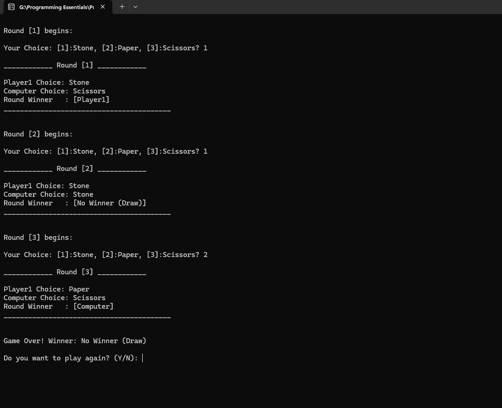

# Rock-Paper-Scissors Game

A simple console-based Rock-Paper-Scissors game developed in C++.

This was my first project focused on practicing functions and procedural programming in C++.

The player competes against the computer for three rounds. The computer randomly selects Stone, Paper, or Scissors, and the program determines the winner of each round and the overall game.

## Features

* Player vs. computer gameplay
* Three rounds per game
* Random computer choices
* Round-by-round winner determination
* Final game result
* Draw detection
* Option to replay the game
* Input validation for player choices
* Console-based interface

## Screenshots



## Technologies

* **C++**
* Standard Library

  * `iostream`
  * `cstdlib`
  * `ctime`

## Concepts Demonstrated

This project was built to practice fundamental C++ programming concepts, including:

* Enumerations (`enum`)
* Structures (`struct`)
* Functions
* Arrays
* Conditional statements
* `switch` statements
* Loops
* Type casting
* Random number generation
* User input and output
* Basic program organization

## How It Works

1. The game starts with three rounds.
2. The player selects:

   * `1` — Stone
   * `2` — Paper
   * `3` — Scissors
3. The computer randomly generates its choice.
4. The program determines the winner of the round.
5. The round results are displayed.
6. After all three rounds, the overall winner is determined based on the number of rounds won.
7. The player can choose to play again.

## How to Run

### Requirements

* A C++ compiler supporting standard C++
* Windows operating system

### Using Visual Studio

1. Clone the repository:

```bash
git clone https://github.com/HeshamSallem510/Rock-Paper-Scissors-CPP.git
```

2. Open the project in **Visual Studio**.
3. Build the solution.
4. Run the application.

### Using a C++ Compiler

If the source file is named `main.cpp`, compile it with:

```bash
g++ main.cpp -o RockPaperScissors
```

Then run:

```bash
RockPaperScissors.exe
```

> The application uses `system("cls")`, so the current implementation is intended for Windows.

## Example

```text
Round [1] begins:

Your Choice: [1]:Stone, [2]:Paper, [3]:Scissors? 2

____________ Round [1] ____________

Player1 Choice: Paper
Computer Choice: Stone
Round Winner   : [Player1]
```

## Author

**Hesham Elsayed**
